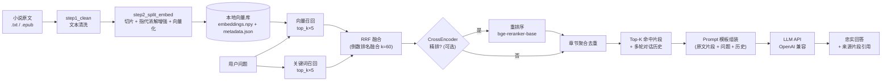

# 📚 NovelRAG — 小说领域 RAG 桌面问答系统


> **NovelRAG** 是一个面向中文小说语料的 **RAG（Retrieval-Augmented Generation）端到端应用**：
> 从 txt / epub 原文出发，自动完成「编码修复 → 文本清洗 → 句子级滑动窗口切片 → 本地嵌入向量化 →
> 语义检索 → Prompt 组装（含多轮上下文）→ LLM 生成」，并内置多项目管理、向量库导入与聊天日志。

**English abstract**: A desktop RAG application for Chinese novels, covering the full offline pipeline —
encoding repair, rule-based text cleaning, sentence-level sliding-window chunking, local embedding,
cosine semantic retrieval (with keyword fallback), prompt templating with multi-turn context, and an
OpenAI-compatible LLM backend. Supports both .txt and .epub input. No cloud dependency for indexing; all corpora stay local.

---

## ✨ 核心特性

- 📚 **多项目管理**：创建 / 切换 / 删除多个小说项目，支持导入已有向量库（.npy + .json）
- 📖 **多格式支持**：`.txt` 和 `.epub` 一键导入；epub 自动提取章节文本并转为纯文本走清洗管线，支持导入已有向量库（.npy + .json）
- 🧹 **可插拔文本清洗**：6 种规则（去除广告水印、页码、拼音残留、修复 GBK 编码错字等），支持自定义脏词
- 📝 **句子级智能切片**：以句子为单位 + 重叠窗口滑动切分，避免切断语义
- 🔍 **混合召回 + 精排**：向量语义召回 + 关键词召回经 RRF（倒数排名融合）合并，可选 CrossEncoder 重排进一步提升精度；未配置嵌入模型时自动回退纯关键词检索，功能不瘫痪
- 💬 **多轮对话**：手动拼接最近上下文 + 轮数上限，防止上下文膨胀与接口超时
- ⚙️ **Prompt 模板外置**：可编辑系统提示，强制模型「仅依据原文、禁止编造」
- 🛡️ **密钥安全**：API Key 不写死在仓库 —— 支持环境变量 `DEEPSEEK_API_KEY` 兜底
- ⌨️ **CLI 一键管线**：`ingest / ask / chat / list / demo`，无 GUI 也能「txt + API Key → 可问答 RAG 项目」

## 🏗️ 系统架构



## 🧰 技术栈

| 模块 | 技术 |
|---|---|
| 界面 | customtkinter / tkinter |
| 文本清洗 | 正则 + 中文网文脏数据映射表（GBK 错字、水印广告、拼音残留） |
| 切片策略 | 句子滑动窗口 + 重叠（`split_text_by_sentences`） |
| 嵌入模型 | sentence-transformers（本地推理，可选；支持 HF 模型名自动下载） |
| 混合召回 | numpy 余弦相似度 + 关键词匹配 + RRF 融合（无重依赖、跨平台） |
| 精排 | sentence-transformers CrossEncoder（bge-reranker-base，可选，GPU 加速） |
| 生成模型 | OpenAI 兼容 API（默认 DeepSeek） |
| 命令行 | argparse（ingest / ask / chat / list / demo） |
| 配置 | JSON + 环境变量 |
| 测试 | pytest |
| 运行时产物 | 对话日志 Markdown、Numpy 向量库 |

## 💡 关键设计决策

1. **为什么用 numpy 原生实现向量检索，而不引入 faiss / chromadb？**
   单本小说向量化后约数千~数万 chunk，矩阵点积 + `argsort` 毫秒级返回，足以覆盖目标量级；
   零重依赖、跨平台可移植、便于理解原理。语料量级上升时可无缝替换为 faiss / hnswlib。
2. **双通道检索保证健壮性**：嵌入模型缺失或加载失败时自动降级关键词检索（位置加权打分），
   不会因为环境问题导致应用不可用；有向量时按 `top_k × 3` 召回再截断，留出后续重排空间。
3. **清洗规则针对中文网文真实脏数据设计**：GBK/UTF-8 混排错字（如「夭才→天才」「入间→人间」）、
   站点水印广告、拼音残留、伪章节目录等，规则可插拔、可自定义脏词。
4. **忠实度优先的 Prompt 工程**：系统提示显式要求「只使用提供的原文片段回答，不编造」；
   模板完全外置可编辑，便于对不同模型做适配实验。
5. **本地优先与隐私**：全文清洗、切片、向量化均在本地完成；聊天记录按项目落盘为 Markdown，可移植、可审计。
6. **小说检索专属增强（novel_context.py）**：
   - *指代消解前缀注入*：切片后若 chunk 以「他/她/它」开头且前文解析出主角名，向量化前
     注入 `【前文主语：主角名】` 前缀（metadata 仍存原文，仅检索/向量化用），解决
     「问林雷时搜不到只写他的片段」的漏召回；
   - *章节聚合重排*：宽松召回后按章节聚合（每章保留最高分）再排序截断，避免 top_k
     结果集中在一章内、漏掉语义相关的其他章节（多样性）。
   两者均零额外依赖、纯规则启发式，重排前 `top_k × 3` 召回为聚合留出余量。
7. **混合召回（RRF）优于单路向量检索**：中文小说中，专有名词（人名、功法、地名）
   的精确匹配靠关键词更可靠，而语义近似靠向量更可靠。两路各取 `top_k×5`，
   用 Reciprocal Rank Fusion（k=60）合并排名分数，既保留语义泛化又保证精确命中，
   比纯向量检索在"主角名/功法名"类问题上召回率显著提升。
8. **CrossEncoder 精排作为可选增强**：混合召回取 `top_k×3` 候选后，
   可用 `bge-reranker-base` 做 query-document 对打分重排，解决"向量相似度高但
   实际不相关"的假阳性问题。GPU 上单条精排毫秒级，可通过 config 或 `--rerank`
   开关控制，未配置重排模型时自动跳过，不影响基础检索。

## 📁 目录结构

```
novel-rag/
├── main.py                 # 主程序入口（GUI）
├── novel_rag.py            # 命令行入口（CLI：ingest / ask / chat / list / demo）
├── project_wizard.py       # 新建项目向导
├── project_manager.py      # 项目配置与 CRUD
├── settings_window.py      # 系统设置窗口
├── config_manager.py       # 全局配置（含环境变量 API Key 兜底）
├── rag_retriever.py        # RAG 检索核心（RRF 混合召回 + CrossEncoder 精排 + 章节聚合）
├── novel_context.py        # 小说检索增强：指代消解前缀注入 + 章节聚合重排
├── step1_clean.py          # 文本清洗模块
├── step2_split_embed.py    # 切片与向量化模块（自动 GPU/CPU 推理）
├── api_client.py           # LLM API 客户端
├── chat_logger.py          # 聊天日志
├── message_bubble.py       # 聊天气泡组件
├── format_loader.py        # 多格式加载器（txt 直读 / epub 提取）
├── utils.py                # 路径 / 文本工具函数（含 GPU 设备自动检测）
├── scripts/
│   ├── rebuild_embeddings.py   # 一键补 embeddings.npy（向量库损坏时用）
│   └── download_models.py      # 下载模型到本地 models/（首次 clone 后运行一次）
├── tests/                  # 单元测试（83 项，pytest 全通过）
├── config.example.json     # 配置模板（复制为 config.json 后填写）
├── requirements.txt
└── README.md
```

> 运行时自动生成的 `config.json`（含真实 API Key）、`novel_config.json`、
> `data/`（版权语料与向量库）、`chat_logs/` 均已被 `.gitignore` 排除，**不会进入版本库**。
> **例外**：`data/demo/`（内置原创示例小说的向量库）已通过 `.gitignore` 白名单放行，随仓库发布，
> 确保 clone 后开箱即用。

## ⚡ 面试官一键运行验证

```bash
# 1. 装环境（Windows 双击 setup_env.bat，或手动执行）
pip install torch torchvision torchaudio --index-url https://download.pytorch.org/whl/cu128
pip install -r requirements.txt

# 2. 设 API Key（任意 OpenAI 兼容接口，如 DeepSeek）
$env:DEEPSEEK_API_KEY="sk-xxxx"          # PowerShell
# export DEEPSEEK_API_KEY=sk-xxxx        # Linux/Mac

# 3. 跑通全流程（原创示例小说，无版权风险，自动下载嵌入模型约 95MB）
python novel_rag.py demo

# 4. 验证问答（不需要 API Key 也能验证检索链路）
python novel_rag.py ask --name demo "沈青的师父是谁？"
```

> 国内网络：首次下载模型前设置 `$env:HF_ENDPOINT="https://hf-mirror.com"` 加速。
> 完全离线：先运行 `python scripts/download_models.py --embedding-small` 下载模型到本地。

## 🚀 快速开始

> 💡 **0 分钟体验（推荐第一次）** —— 没有小说语料也想看效果：
>
```bash
 # 一条命令生成示例小说 + 完整向量库（首次会下载嵌入模型约 95MB）
 python novel_rag.py demo
 # 然后启动 GUI 或命令行提问：
 python main.py                       # GUI 选「当前项目: demo」开始对话
 python novel_rag.py ask --name demo "沈青的师父是谁？"  # CLI 单次问答
```
>
 **⚠ 仓库预置 demo 向量库**：`data/demo/` 已随仓库发布（含原创小说原文 + embeddings.npy + metadata.json，无版权风险）。clone 后首次运行任何命令时 `ProjectManager` 自动注册 demo 项目并设为当前项目，**开箱即用**。如需升级为真实语义向量（如换模型后），执行 `python novel_rag.py demo --force` 重建。环境变量 `HF_ENDPOINT=https://hf-mirror.com` 可在国内加速模型下载。

> 💡 **5 分钟用你自己的小说跑通（推荐 CLI）** —— 只需要**一本小说的 .txt + 一个 API Key**：

```bash
# 1. 安装依赖（Windows 用户可直接运行一键脚本：setup_env.bat，自动装 GPU 版 torch + 全部依赖）
pip install -r requirements.txt

# 2. 提供 API Key（推荐环境变量，密钥不落盘；Windows PowerShell 用 $env:DEEPSEEK_API_KEY=...）
export DEEPSEEK_API_KEY=sk-xxxxxxxx

# 3. 导入你自己的小说（.txt 或 .epub）：清洗 → 切片 → 向量化 → 注册项目（一条命令完成）
python novel_rag.py ingest ./盘龙.txt --name 盘龙
# epub 同理（自动提取章节文本）：
# python novel_rag.py ingest ./遮天.epub --name 遮天

# 4. 提问
python novel_rag.py ask --name 盘龙 "林雷在第四重神界遇到了什么？"

# 5.（可选）命令行多轮对话，或启动 GUI
python novel_rag.py chat --name 盘龙
python main.py
```

> 环境验证（不联网、无版权风险）：`python novel_rag.py demo` 会生成一段原创小说并自动跑通全流程，
> 之后可用 `python novel_rag.py ask --name demo "青云剑诀的心法口诀是什么？"` 验证问答链路。

### 1. 环境要求

- Python 3.10+（推荐 3.11 / 3.13）
- pip
- **GPU 加速（可选，推荐有 NVIDIA 显卡的用户）**：
  RTX 3060 及以上显卡安装 CUDA 版 torch 后向量化自动使用 GPU（batch_size 从 32 → 256，速度提升 10~20×）：
  ```bash
  # 已有 CPU 版 torch 时先卸载，再装 CUDA 版（RTX 30/40/50 系列用 cu128）
  pip uninstall torch torchvision torchaudio -y
  pip install torch torchvision torchaudio --index-url https://download.pytorch.org/whl/cu128
  # 注意：RTX 50 系列（Blackwell, sm_120）必须 cu128+，cu124/cu126 不支持
  ```
  无 GPU 或未装 CUDA 版 torch 时自动回退 CPU，不影响功能。

### 2. 安装依赖

```bash
pip install -r requirements.txt
```

> CPU 环境建议先安装 CPU 版 torch 再装 sentence-transformers，避免拉取庞大的 GPU 依赖：
> ```bash
> pip install torch --index-url https://download.pytorch.org/whl/cpu
> pip install -r requirements.txt
> ```
> 未安装成功时系统会**自动降级为关键词检索**，不影响主流程。

### 3. 配置

**模型（四种方式，任选其一，都不需要手动编辑代码）：**

```bash
# 方式 A（推荐）：复制 .env.example 为 .env 并填入 Key —— 一条命令搞定，密钥不落盘不入库
cp .env.example .env        # Windows: copy .env.example .env
# 然后用编辑器打开 .env，填入 DEEPSEEK_API_KEY=sk-xxxx

# 方式 B（二选一）：直接设置系统环境变量，密钥不落盘
#   Windows PowerShell: $env:DEEPSEEK_API_KEY="sk-xxxx"
#   macOS / Linux:      export DEEPSEEK_API_KEY=sk-xxxx

# 方式 C：复制模板后填写 config.json（旧方式，密钥会写在配置文件里）
cp config.example.json config.json   # Windows: copy config.example.json config.json

# 方式 D：临时指定（仅本次命令）
python novel_rag.py ask --name 盘龙 "你的问题" --api-key sk-xxxxxxxx
```

> 优先级：系统环境变量 > .env > config.json > 命令行参数；程序启动时会自动加载项目根目录的 .env。

**嵌入模型（语义检索用，自动下载）：**

- 默认 `BAAI/bge-small-zh-v1.5`：首次向量化时自动从 HuggingFace 下载并缓存（约 95MB，自动选择 GPU/CPU），无需手动配置
- **无网络 / 国内网络不稳定**：运行下载脚本（内置 hf-mirror 国内镜像）：
  ```bash
  python scripts/download_models.py --embedding-small   # 仅下载 bge-small（推荐，先跑通）
  python scripts/download_models.py                     # 下载全套模型（含 bge-base / reranker）
  ```
  下载后 `config.json` 中 `embedding_model_path` 自动写为 `models/bge-small-zh-v1.5`（本地路径，优先读取，完全离线）
- 国内用户建议设环境变量加速自动下载：`$env:HF_ENDPOINT="https://hf-mirror.com"` (PowerShell)
- **手动放置**：也可自行将模型文件夹放到 `models/bge-small-zh-v1.5/`，然后在 `config.json` 中填相对路径
- 想纯关键词模式（完全离线，无需模型）：把 `embedding_model_path` 置空即可
- **重排模型（可选，推荐开启）**：`BAAI/bge-reranker-base`（约 220MB），开启后对混合召回候选做 CrossEncoder 精排，显著提升排序质量。下载：`python scripts/download_models.py --reranker`，然后在 config.json 中设置 `"enable_rerank": true`

### 4. 启动

```bash
python main.py          # 图形界面
python novel_rag.py list   # 命令行查看已建项目
```

### 5. 使用流程

- **命令行（推荐脚本化）**：`ingest` 导入新小说 → `ask` / `chat` 问答 → `list` 查看项目
- **GUI**：1️⃣➕ 新建 RAG 项目：输入小说名、选择 `.txt` / `.epub` 源文件 → 配置清洗规则与切片参数 → 自动完成「清洗 → 切片 → 向量化」
  2️⃣📖 选择已有小说 / 📥 导入向量文件：复用已生成的 `.npy + .json` 向量库，秒级切换项目
  3️⃣开始对话：问题将先检索原文片段，再由 LLM 依据片段作答

## 🖼️ 使用演示

> 截图位：在下方替换为「主界面」「问答示例」两张实际运行截图（推荐 16:10）。

**问答效果（结构示意，忠实引用原文）：**

```
Q：沈青的师父是谁？灰衣老者究竟是什么人？
A：灰衣老者正是剑庐主人柳青山，也就是沈青的师父。剑庐收徒十年未必有一人，
   柳青山看重的是心性而非天赋，第一课不教剑教做人。
   [来源: 第二章 剑庐第一课]
```

## ✅ 测试

```bash
python -m pytest tests/ -v
```

覆盖范围：文本清洗规则（编码纠错 / 去广告 / 去页码）、句子切片边界、关键词检索回退路径、
嵌入模型解析与配置冷启动、指代消解前缀注入与章节聚合重排、向量归一化检索、
API 客户端重试与响应解析、demo 自动注册与 cmd_demo 分支、cmd_ingest 同路径跳过、
epub 格式加载与 HTML 标签剥离。

120+ 项测试全过（含混合召回 RRF、CrossEncoder 精排、降级路径等），核心用例秒级完成。

## 效果评估思路

- 内置可执行评估脚本 eval_retrieval.py（无需 API Key、无需联网）：
  `ash
  # 对 demo 项目跑 12 道「问题-预期章节」QA，量化召回：
  python eval_retrieval.py --name demo --top-k 3
  # 输出示例：QA 总数: 12 / Recall@3 = 12/12 = 100.0%
  `
- 命中判定按「同章」（章节名前缀匹配），输出逐题命中章节明细，可 --json-out 导出；
- 自建语料时，把 QA 集写成 JSON（question + 预期命中章节）即可换库复跑；
- 对生成答案做**忠实度人工抽检**：答案关键事实是否能在命中片段中找到依据、有无编造。
## 🗺️ Roadmap

- [x] 多项目管理 + 向量库导入
- [x] 文本清洗、句子级切片、向量化与检索
- [x] 多轮对话与 Prompt 模板外置
- [x] CLI 一键管线（novel_rag.py：ingest / ask / chat / list / demo）
- [x] epub 格式支持（format_loader.py，懒加载 ebooklib + BeautifulSoup）
- [x] 切片阶段保留真实章节标题，回答精确到「第 X 章」
- [x] 指代消解前缀注入 + 章节聚合重排（novel_context.py，见「关键设计决策」）
- [x] 内置 demo 向量库（随仓库预置，clone 后首跑自动注册；`--force` 可重建为真实语义向量）
- [x] CrossEncoder 重排（bge-reranker-base，CLI/GUI 双入口支持，`--rerank` / `--no-rerank` 命令行开关）
- [ ] HTTP 服务接口，便于远程脚本化评估
- [x] 混合召回（向量 + 关键词 RRF 融合，中文 bigram 扩展）

## 📄 License

[MIT](./LICENSE)
