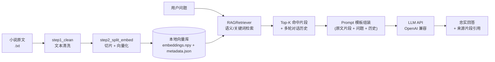

# 📚 NovelRAG — 小说领域 RAG 桌面问答系统


> **NovelRAG** 是一个面向中文小说语料的 **RAG（Retrieval-Augmented Generation）端到端应用**：
> 从 txt 原文出发，自动完成「编码修复 → 文本清洗 → 句子级滑动窗口切片 → 本地嵌入向量化 →
> 语义检索 → Prompt 组装（含多轮上下文）→ LLM 生成」，并内置多项目管理、向量库导入与聊天日志。

**English abstract**: A desktop RAG application for Chinese novels, covering the full offline pipeline —
encoding repair, rule-based text cleaning, sentence-level sliding-window chunking, local embedding,
cosine semantic retrieval (with keyword fallback), prompt templating with multi-turn context, and an
OpenAI-compatible LLM backend. No cloud dependency for indexing; all corpora stay local.

---

## ✨ 核心特性

- 📚 **多项目管理**：创建 / 切换 / 删除多个小说项目，支持导入已有向量库（.npy + .json）
- 🧹 **可插拔文本清洗**：6 种规则（去除广告水印、页码、拼音残留、修复 GBK 编码错字等），支持自定义脏词
- 📝 **句子级智能切片**：以句子为单位 + 重叠窗口滑动切分，避免切断语义
- 🔍 **双通道检索**：优先本地向量语义检索；未配置嵌入模型时自动回退为关键词检索，功能不瘫痪
- 💬 **多轮对话**：手动拼接最近上下文 + 轮数上限，防止上下文膨胀与接口超时
- ⚙️ **Prompt 模板外置**：可编辑系统提示，强制模型「仅依据原文、禁止编造」
- 🛡️ **密钥安全**：API Key 不写死在仓库 —— 支持环境变量 `DEEPSEEK_API_KEY` 兜底

## 🏗️ 系统架构



## 🧰 技术栈

| 模块 | 技术 |
|---|---|
| 界面 | customtkinter / tkinter |
| 文本清洗 | 正则 + 中文网文脏数据映射表（GBK 错字、水印广告、拼音残留） |
| 切片策略 | 句子滑动窗口 + 重叠（`split_text_by_sentences`） |
| 嵌入模型 | sentence-transformers（本地推理，可选） |
| 向量检索 | numpy 余弦相似度（无重依赖、跨平台） |
| 生成模型 | OpenAI 兼容 API（默认 DeepSeek） |
| 配置 | JSON + 环境变量 |
| 测试 | pytest |
| 运行时产物 | 对话日志 Markdown、Numpy 向量库 |

## 💡 关键设计决策

1. **为什么用 numpy 原生实现向量检索，而不引入 faiss / chromadb？**
   单本小说向量化后约数千~数万 chunk，矩阵点积 + `argsort` 毫秒级返回，足以覆盖目标量级；
   零重依赖、跨平台可移植、便于理解原理。语料量级上升时可无缝替换为 faiss / hnswlib。
2. **双通道检索保证健壮性**：嵌入模型缺失或加载失败时自动降级关键词检索（位置加权打分），
   不会因为环境问题导致应用不可用；有向量时按 `top_k × 3` 召回再截断，留出后续重排空间。
3. **清洗规则针对中文网文真实脏数据设计**：GBK/UTF-8 混排错字（如「夭才→天才」「入间→人间」）、
   站点水印广告、拼音残留、伪章节目录等，规则可插拔、可自定义脏词。
4. **忠实度优先的 Prompt 工程**：系统提示显式要求「只使用提供的原文片段回答，不编造」；
   模板完全外置可编辑，便于对不同模型做适配实验。
5. **本地优先与隐私**：全文清洗、切片、向量化均在本地完成；聊天记录按项目落盘为 Markdown，可移植、可审计。

## 📁 目录结构

```
novel-rag/
├── main.py                 # 主程序入口（GUI）
├── project_wizard.py       # 新建项目向导
├── project_manager.py      # 项目配置与 CRUD
├── settings_window.py      # 系统设置窗口
├── config_manager.py       # 全局配置（含环境变量 API Key 兜底）
├── rag_retriever.py        # RAG 检索核心（向量 / 关键词双通道）
├── step1_clean.py          # 文本清洗模块
├── step2_split_embed.py    # 切片与向量化模块
├── api_client.py           # LLM API 客户端
├── chat_logger.py          # 聊天日志
├── message_bubble.py       # 聊天气泡组件
├── utils.py                # 路径 / 文本工具函数
├── tests/                  # 单元测试
├── config.example.json     # 配置模板（复制为 config.json 后填写）
├── requirements.txt
└── README.md
```

> 运行时自动生成的 `config.json`（含真实 API Key）、`novel_config.json`、`data/`（版权语料与向量库）、
> `chat_logs/` 均已被 `.gitignore` 排除，**不会进入版本库**。

## 🚀 快速开始

### 1. 环境要求

- Python 3.8+
- pip

### 2. 安装依赖

```bash
pip install -r requirements.txt
```

> CPU 环境建议先安装 CPU 版 torch 再装 sentence-transformers，避免拉取庞大的 GPU 依赖：
> ```bash
> pip install torch --index-url https://download.pytorch.org/whl/cpu
> pip install -r requirements.txt
> ```
> 未安装成功时系统会**自动降级为关键词检索**，不影响主流程。

### 3. 配置

```bash
# 复制配置模板
cp config.example.json config.json   # Windows: copy config.example.json config.json
```

然后在配置中填写：

- **模型 API Key**：可直接填在 `config.json`，或设置环境变量 `DEEPSEEK_API_KEY`（推荐，避免密钥落盘）
- **嵌入模型路径**（可选）：本地 sentence-transformers 模型目录，用于语义检索
- **重排模型路径**（可选，开发中）：预留 CrossEncoder 接入位

### 4. 启动

```bash
python main.py
```

### 5. 使用流程

1. **➕ 新建 RAG 项目**：输入小说名、选择 `.txt` 源文件 → 配置清洗规则与切片参数 → 自动完成「清洗 → 切片 → 向量化」
2. **📖 选择已有小说 / 📥 导入向量文件**：复用已生成的 `.npy + .json` 向量库，秒级切换项目
3. **开始对话**：问题将先检索原文片段，再由 LLM 依据片段作答

## 🖼️ 使用演示

> 截图位：在下方替换为「主界面」「问答示例」两张实际运行截图（推荐 16:10）。

**问答效果（结构示意，忠实引用原文）：**

```
Q：叶凡在荒古禁地中得到了什么机缘？
A：根据原文，叶凡在荒古禁地……（引用原文片段作答）
   [来源: 第XX章 荒古禁地]
```

## ✅ 测试

```bash
python -m pytest tests/ -v
```

覆盖范围：文本清洗规则（编码纠错 / 去广告 / 去页码）、句子切片边界、关键词检索回退路径。

## 📈 效果评估思路

- 构建「问题-标准答案」QA 集（忠于原著剧情、数字准确），用 **Recall@k** 评估检索召回；
- 对生成答案做**忠实度人工抽检**：答案关键事实是否能在命中片段中找到依据、有无编造；
- 对比 `top_k`、切片大小、是否重叠等参数对检索质量的影响。

## 🗺️ Roadmap

- [x] 多项目管理 + 向量库导入
- [x] 文本清洗、句子级切片、向量化与检索
- [x] 多轮对话与 Prompt 模板外置
- [ ] 接入 CrossEncoder 重排（配置项已预留）
- [ ] 切片阶段保留真实章节标题，回答精确到「第 X 章」
- [ ] 提供 CLI/HTTP 接口，便于脚本化自动评估
- [ ] 混合检索（BM25 + 向量）

## 📄 License

[MIT](./LICENSE)
